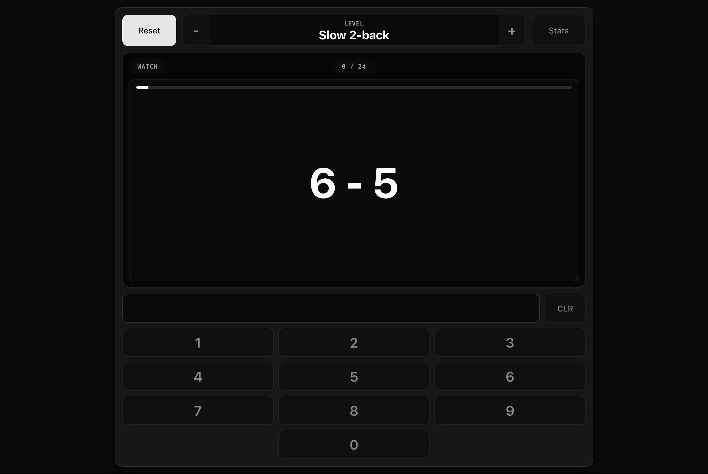

# N-Back Math

Mobile-first arithmetic `n-back` trainer with a static web app and a native
SwiftUI iOS app.



Play it on GitHub Pages: https://zeulewan.github.io/n-back-math/

## Project Layout

- `apps/web` contains the browser app published through GitHub Pages.
- `apps/ios/NBackMath` contains the native SwiftUI frontend and game state.
- `ios/App` contains the Xcode project, signing settings, app icon, and launch
  screen for the Swift app.
- `fastlane` contains App Store metadata and release lanes.
- Root `index.html` and `privacy.html` keep existing GitHub Pages URLs working.

## Web App

Build the static site into `dist`:

```sh
npm install
npm run build:web
```

## iPhone App

Open the native SwiftUI app project on a Mac with Xcode:

```sh
npm install
npm run generate:icon
npm run generate:screenshots
npm run open:ios
```

In Xcode, choose a signing team, then run the `App` target on an iPhone or
simulator. Review generated App Store screenshots in `fastlane/screenshots`
before running any upload or submit lane. The screenshot script builds and
launches the native app in Simulator; it does not upload anything.

## Play

- Use `-` and `+` to change level.
- Press `Start`.
- Answer the problem from `N` steps back.
- Each run is always `24` questions.
- `Slow` gives `4s`; `Fast` gives `3s`.
- Use `Stats` to review saved progress.

Progress is stored on-device. Use `Clear Progress` on the stats page to reset
it.

## Privacy

N-Back Math does not collect personal data. Progress stays on-device in browser
or app storage. Privacy policy: https://zeulewan.github.io/n-back-math/privacy.html
